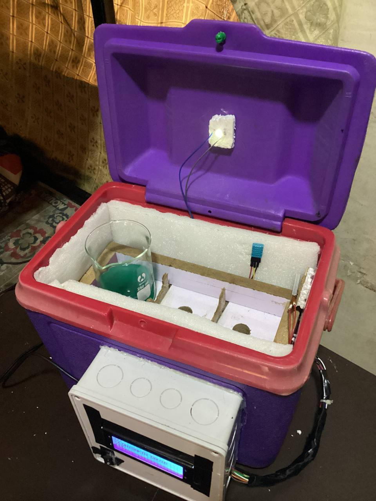
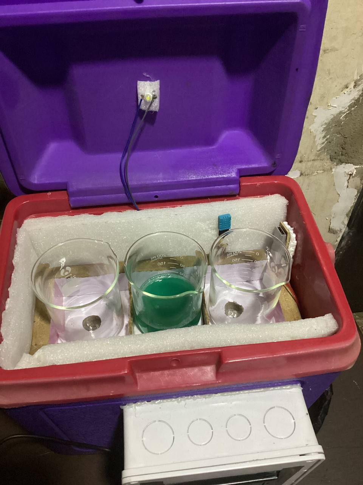

# Portable Incubator For Detection Of Coliform In Water Using IoT

## Project Image

## Description

This repository contains the project "Portable Incubator For Detection Of Coliform In Water Using IoT" created by Olonisakin David and Oguibe Favour. The project focuses on developing a portable incubator device that utilizes Internet of Things (IoT) technology for the detection of coliform bacteria in water.

## Features

- **IoT Connectivity**: The incubator is equipped with IoT capabilities, allowing real-time data transmission and remote monitoring of incubation processes.

- **Coliform Detection**: The device employs cost-effective techniques for detecting coliform bacteria in water samples, contributing to early water quality assessment.

- **Portability**: The incubator is designed to be easily portable, making it convenient for field applications and areas with limited laboratory infrastructure.

## Incubator Images

  
  

## Authors

- Olonisakin David
  
- Oguibe Favour
  

## Authors' Image

## Blynk Monitoring

---

**Please Note**: This README will be periodically updated with additional information, usage instructions, and resources as needed.
